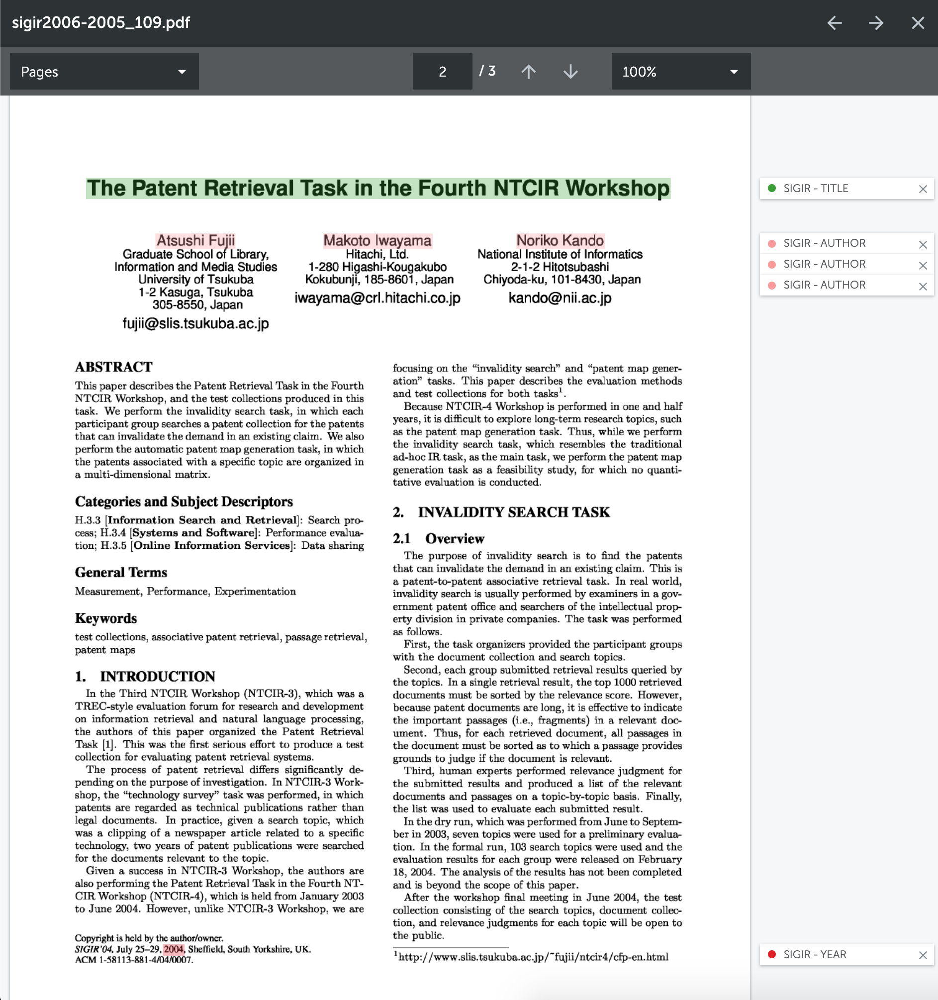

<a href="packages/document-viewer/README.md">Document Viewer</a>
|
<a href="packages/server/README.md">Web Application Demo</a>

## About Spectator

Spectator is a document viewer. It enables annotation of documents for the creation of training sets. There are many document viewers available today, so why a new one?

- Most fully featured ones are for-profit rather than free to the community.
- Development is either inactive or slow.
- Several do not facilitate annotation of text or have restrictive supported formats.
- Desktop only version limit scalability of user studies.
- Most are not "battle-tested" in a commercial product.

In short, Spectator is a React component that you can drop in your project and start to use!

## Development

Spectator is still actively being worked on. We started by re-implementing a subset of the document viewer we have in our commercial product and challenging all of the assumptions we made (3 years ago) to see if they are still valid today. The goal is to re-implement it, part by part, with empirical evidence that we made the best decision. So, until we release version 1.0 of the react component, expect the things to move around.